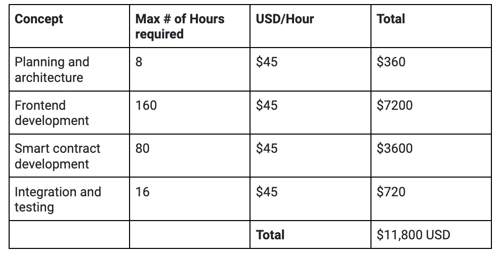

# RFP-3 OWA 

# Introduction
The Open Web Academy team is a highly experienced Web 3 developer on the NEAR Ecosystem. This team is going to create the solution required for the Kudos Widget:
1. Luis Mendez, BOS developer who has participated in the ETH Dubai hackathon, who has won the Sushi swap and Gains Network track with BOS.
2. Daniel Mora, smart contract developer experienced in Solidity and Rust for over 3 years.
3. Edward Vergel. Backend and Blockchain developer, Web3 security researcher with 3 years of experience in software development.

# Proposed Solution

## Project approach
We'll start developing modules in the following order to fulfill the request: 
### Authentication
This module will interact with the i-am-human smart contract  to verify the user identity.
### Kudos feed
This module will read all the kudos, showing in the main view.
### Kudos user
This module will read all the user’s kudos as a profile.
Also the user will set up who can send him kudos or comment on them according to the category selected (all, friends, close friends, no one).
Allow recipients to accept or not the new kudos.
### Create a kudo
This module will let any authenticated user create a new kudo for any active user related to him. 
Requiring the creator user to have a  i-am-human-certified before they can send or comment on Kudos.

## Implementation plan
It is expected to complete the project in no more than four weeks, including all development phases.
The project is planned to be developed in 3 stages 
### Planning and Architecture Stage Week 1
Project planning and architecture design. 
### Development Stage 2 Week 1-3  
Frontend development and smart contract development 
### Integration and Testing Stage 3 Week 4
Contract integrations and tests 

## Total price 

## Proposed Timeline
### Start Operations on and stage 1 
Monday May 29
### Development and stage 2
Starting on Monday 5 and finishing on Friday 16 May
### Integration and Testing 
Starting Monday May 19
### App Delivery 
Friday May 23

## Customer success practices
### Building a strong support team 
To provide timely and effective support to the customers.
### Defining success metrics 
To grant the widget success through recopiled metrics.
### Measuring customer satisfaction 
Through the customer feedback
### Continuous improvement 
To deliver the best possible experience to the customers 

## How do you plan to test the solution
### Defining testing objectives 
To each widget component 
### Unit test 
To all smart contracts functions 
### Integration tests 
To check the full software behavior once deployed the smart contracts and the frontend
### Beta release
To receive early feedback from potential customers

## Ongoing support / maintenance proposal
### Defining maintenance scope
### Developing maintenance plan 
For saving the customers reviews and setting maintenance steps. 
### Continuous Improvement 
Continuously reviewing and improving the services based on the customer feedback

## Contractual considerations
We consider the payment of the 50% upfront and 50% once the project is finished.

## References

### All team members are NEAR Certified Developers.
### Eth Dubai Hackathon:
- Sushi Swap widget:
https://bos.gg/#/syi216.near/widget/GNS-Container

- Gains Network widget: https://bos.gg/#/syi216.near/widget/GNS-Container

### Nativo.art - Development of platform and smart contracts
### Open Web Academy
Course of RUST: 
- Tutorial to deploy smart contracts on Aurora Network.
https://www.youtube.com/watch?v=SNuKbeMkQnU&t=15s
